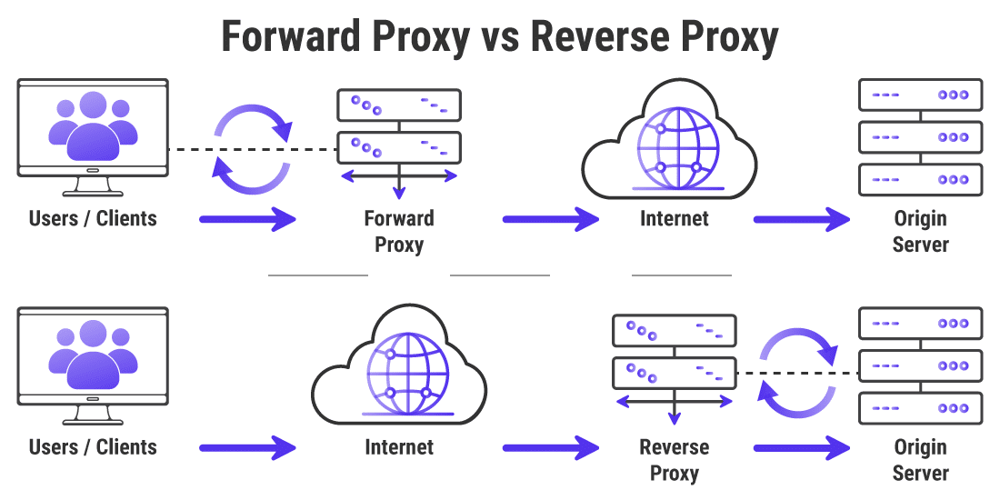
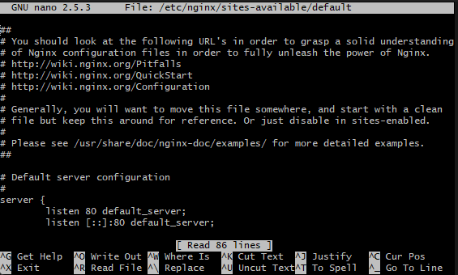

What are ports?  

A port is  a number assigned to uniquely identify a connection endpoint and to direct data to a specific service.  

What is a reverse proxy?   

A reverse proxy is an application that sits in front of back-end applications and forwards client (e.g. browser) requests to those applications.
A reverse proxy effectively serves as a gateway between clients, users, and application servers. It handles all the access policy management and traffic routing, and it protects the identity of the server that actually processes the request.

Common uses for reverse proxies are:
- Load Balancing
- Caching
- Content Delivery
- API Gateways
- Security Scanning


How is it different to a proxy?

Whearas A reverse proxy serves requests on behalf of servers, A traditional forward proxy server allows multiple clients to route traffic to an external network. For instance, a business may have a proxy that routes and filters employee traffic to the public Internet. A reverse proxy, on the other hand, routes traffic on behalf of multiple servers.

- This is often done to monitor traffic and implement policies that may block certain types of request. 

Common uses for proxies are:
- Monitoring
- Logging
- Blocking Requests



 
What is Nginx's default configuration? (hint - 'sites-available' directory)

etc/nginx/sites-available/

How do you set up a Nginx reverse proxy?
- We set up our Nginx configuration in the /etc/nginx/sites-available/default file.
- So first inside the git bash terminal, navigate into the folder where your vagrantfile is 
- Then nagivate into your vm 
```cd ~ ```  then  ```  cd sample_repo ```  then ```  tech201_virtualisation```
- Then enter your virtual machine with ```  vagrant ssh ```
- Open the file for editing
``` sudo nano /etc/nginx/sites-available/default```
  

