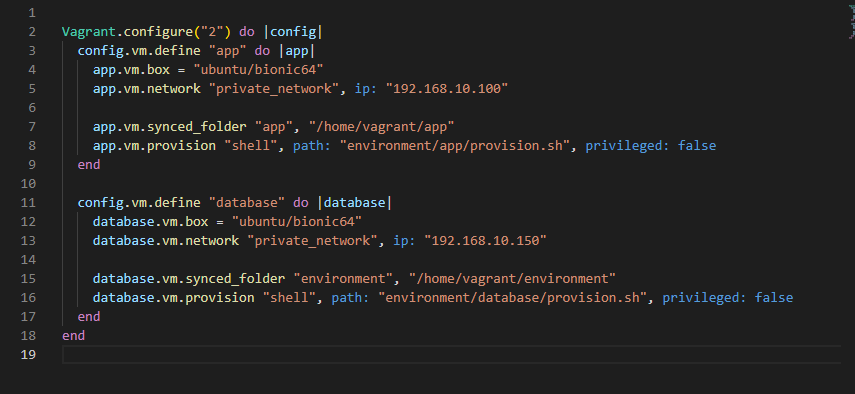
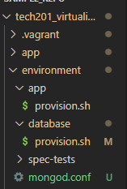
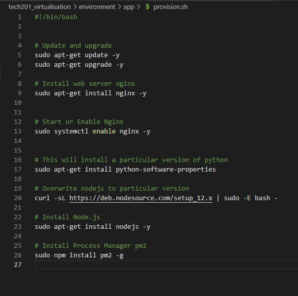
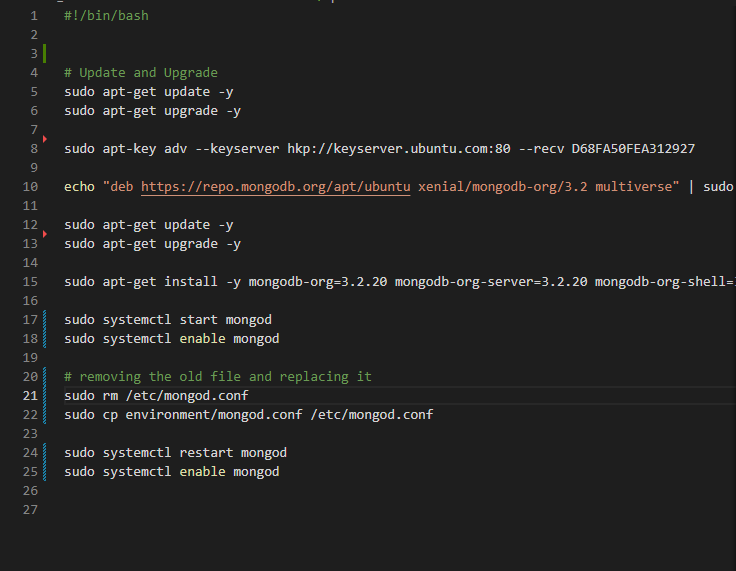
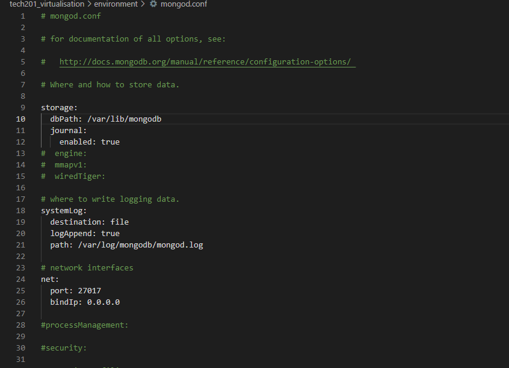

Step 1
- we have got our two virtual machines connected and app running maunally
with the information, we need showing up

- Now we want to provision this process so that we dont need to enter all the commands manually
we will automate the process

- first I will update my vagrant file with the correct configuration so that it knows 
where to get the information it needs to communicate over to virtual box.

- Now that ive moved my provision file in to my app folder I have to change the path in my 
vagrant file, and I will add a line also for my database provision.sh

- Next we need to create two seperate provision files for app and database, I have
created two new provision files in the environment folder. 

- inside the app provision file we will set up the commands we need

- inside the database provision file we will set up the commands we need

- we need to create a mongod.conf file to change the bindip address to 0.0.0.0

Step 2

vagrant ssh app

cd app

export DB_HOST=mongodb://192.168.10.150:27017/posts

printenv DB_HOST

nano .bashrc

npm install

node seeds/seed.js

npm start

