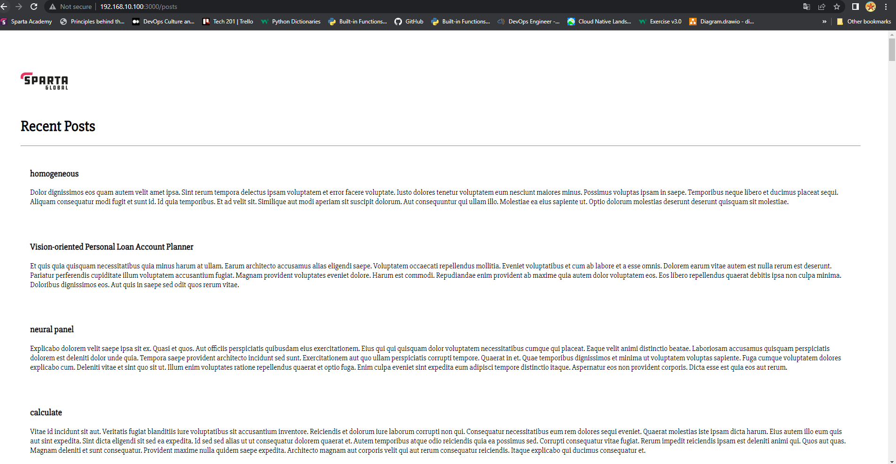

Step 1
- we have got our two virtual machines connected and app running maunally
with the information, we need showing up

- Now we want to provision this process so that we dont need to enter all the commands manually
we will automate the process

- First we need to create two seperate provision files for app and database, I have
created two new provision files in the environment folder. 


- Next I will update my vagrant file with the correct configuration so that it knows 
where to get the information it needs to communicate over to virtual box.

- Now that ive moved my provision file in to my app folder I have to change the path in my 
vagrant file, and I will add a line also for my database provision.sh


- inside the app provision file we will set up the commands we need


- inside the database provision file we will set up the commands we need


- we need to create a mongod.conf file to change the bindip address to 0.0.0.0


Step 2
- go into your bash terminal and navigate into your app vm
- once your are in the same location as your vagrant file
- use the following commands to set a persistent variable ang get your app up and running.

```vagrant ssh app```

```cd app```

```export DB_HOST=mongodb://192.168.10.150:27017/posts```    create your environment variable

```printenv DB_HOST```   check that your variable exists

```nano .bashrc```           to create a persistant variable

```npm install```

```node seeds/seed.js```   make sure the database is seeded

```npm start```

- Check that the database content is now availible once you refresh the browser
http://192.168.10.100:3000/posts and you should see



